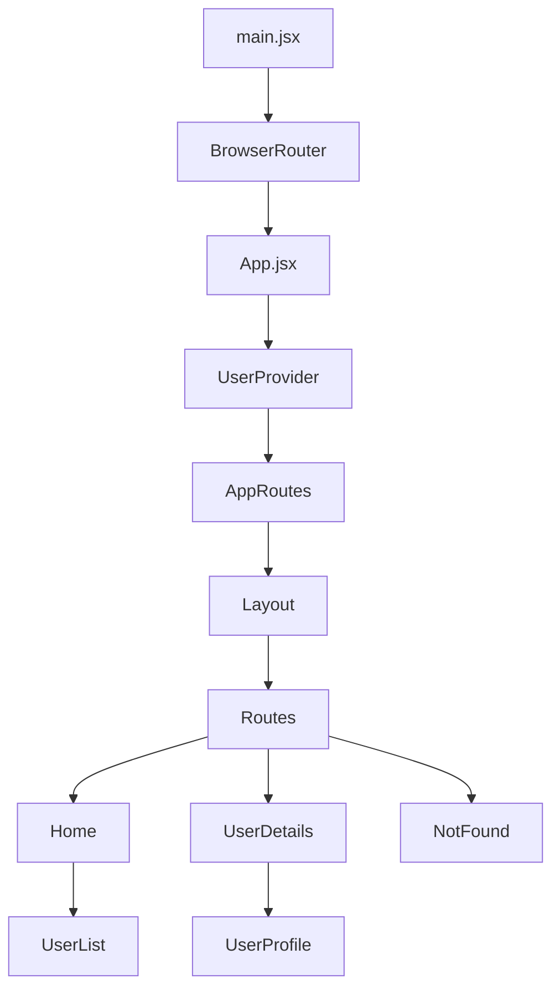
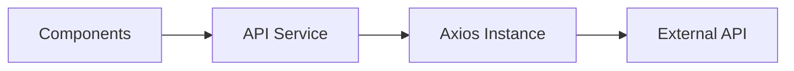

# Refactoring Plan: Mini User Management App

## Project Analysis Summary

### Current Tech Stack

- **React 18.3.1** with Vite 5.4.9
- **React Router DOM 6.27.0**
- **Axios 1.13.5** for API calls
- **styled-components 6.1.13** (installed but not used) - 1. remove styled-component
- **ESLint 9.13.0** for linting

### Current Architecture



---

## Issues Identified

### Critical Bugs

| Issue              | File                                                              | Description                                                 |
| ------------------ | ----------------------------------------------------------------- | ----------------------------------------------------------- |
| Router Duplication | [`main.jsx`](../src/main.jsx:7) and [`App.jsx`](../src/App.jsx:3) | `BrowserRouter` imported in App.jsx but defined in main.jsx |
| Missing Asset      | [`Layout.jsx`](../src/Layout.jsx:2)                               | Imports `grad_glob.png` which does not exist                |
| Wrong Import Path  | [`NotFound.jsx`](../src/NotFound.jsx:2)                           | Path `../src/assets/` should be `../assets/`                |
| Reducer Bug        | [`userReducer.js`](../src/reducers/userReducer.js:14)             | Line 14: `state;` should be `return state;`                 |

### Code Quality Issues

| Issue                    | File                                                                                           | Description                |
| ------------------------ | ---------------------------------------------------------------------------------------------- | -------------------------- |
| Unused Import            | [`Layout.jsx`](../src/Layout.jsx:1)                                                            | React import unused        |
| Unused Import            | [`Home.jsx`](../src/pages/Home.jsx:1)                                                          | React import unused        |
| Console in Prod          | [`UserProfile.jsx`](../src/components/UserProfile.jsx:9)                                       | `console.log` left in code |
| Missing Props Validation | Multiple                                                                                       | No PropTypes or TypeScript |
| No Error Handling UI     | [`UserList.jsx`](../src/UserList.jsx:17), [`UserDetails.jsx`](../src/pages/UserDetails.jsx:19) | Only console.log on errors |

### Architecture Issues

| Issue                         | Description                                |
| ----------------------------- | ------------------------------------------ |
| No API Service Layer          | API calls scattered in components          |
| No Loading States             | No UI feedback during data fetching        |
| No Error Boundaries           | App crashes on component errors            |
| ProtectedRoute Not Integrated | Component exists but unused                |
| styled-components Unused      | Installed but no styled components created |

### UI/Styling Issues

| Issue                | Description                                |
| -------------------- | ------------------------------------------ |
| No Design System     | Ad-hoc styling with no consistency         |
| CSS Scattered        | Styles split between App.css and index.css |
| No Responsive Design | No mobile-first approach                   |
| Inline Styles        | Mixed inline styles in components          |

---

## Refactoring Plan

### Phase 1: Critical Bug Fixes

#### 1.1 Fix Router Duplication

- Remove `BrowserRouter` import from [`App.jsx`](../src/App.jsx:3)
- Keep router in [`main.jsx`](../src/main.jsx:7) only

#### 1.2 Fix Missing Asset

- Option A: Add `grad_glob.png` to assets
- Option B: Use existing [`spacecharter.svg`](../src/assets/spacecharter.svg)

#### 1.3 Fix Import Path in NotFound

- Change `../src/assets/d-skull.svg` to `../assets/d-skull.svg`

#### 1.4 Fix Reducer Bug

- Add `return` statement in default case

---

### Phase 2: Code Quality Improvements

#### 2.1 Remove Unused Imports

- Clean up React imports where not needed
- Remove unused variables

#### 2.2 Add PropTypes or Migrate to TypeScript

```jsx
// Example for Layout.jsx
import PropTypes from "prop-types";

Layout.propTypes = {
  children: PropTypes.node.isRequired,
};
```

#### 2.3 Remove Console Logs

- Remove `console.log` from production code

#### 2.4 Add Error Handling UI

- Create `ErrorMessage.jsx` component
- Add error state to data fetching

---

### Phase 3: Architecture Improvements

#### 3.1 Create API Service Layer



**New Files:**

- `src/services/api.js` - Axios instance with interceptors
- `src/services/userService.js` - User-specific API calls

#### 3.2 Add Loading States

- Create `LoadingSpinner.jsx` component
- Add loading state to context/reducer

#### 3.3 Add Error Boundary

- Create `ErrorBoundary.jsx` component
- Wrap routes with error boundary

#### 3.4 Integrate ProtectedRoute

- Add authentication context
- Protect routes that need authentication

---

### Phase 4: UI/UX Improvements

#### 4.1 Implement styled-components

Replace CSS files with styled-components:

```jsx
// Example structure
src/styles/
├── GlobalStyles.js
├── theme.js
└── styled-components.js
```

#### 4.2 Create Design System

- Define color palette
- Define typography scale
- Define spacing system
- Create reusable styled components

#### 4.3 Add Responsive Design

- Mobile-first approach
- Breakpoints for tablet and desktop

#### 4.4 Improve User Experience

- Add loading skeletons
- Add toast notifications for errors
- Add animations/transitions

---

### Phase 5: New Features

#### 5.1 Authentication System

- Login/Logout functionality
- Protected routes
- User session management

#### 5.2 Additional Pages

- About page
- Contact page
- Settings page

#### 5.3 Enhanced User Features

- User search/filter
- User pagination
- User edit functionality

---

## Proposed File Structure

```
src/
├── components/
│   ├── common/
│   │   ├── Button.jsx
│   │   ├── Card.jsx
│   │   ├── LoadingSpinner.jsx
│   │   ├── ErrorMessage.jsx
│   │   └── ErrorBoundary.jsx
│   ├── layout/
│   │   ├── Layout.jsx
│   │   ├── Header.jsx
│   │   └── Footer.jsx
│   └── users/
│       ├── UserList.jsx
│       ├── UserCard.jsx
│       └── UserProfile.jsx
├── context/
│   ├── UserContext.jsx
│   └── AuthContext.jsx
├── hooks/
│   ├── useUsers.js
│   └── useAuth.js
├── pages/
│   ├── Home.jsx
│   ├── UserDetails.jsx
│   ├── About.jsx
│   ├── Contact.jsx
│   ├── Login.jsx
│   └── NotFound.jsx
├── reducers/
│   └── userReducer.js
├── services/
│   ├── api.js
│   └── userService.js
├── styles/
│   ├── GlobalStyles.js
│   └── theme.js
├── utils/
│   └── constants.js
├── App.jsx
├── AppRoutes.jsx
├── routes-paths.js
└── main.jsx
```

---

## Implementation Priority

| Priority | Phase                       | Effort |
| -------- | --------------------------- | ------ |
| 1        | Phase 1: Critical Bug Fixes | Low    |
| 2        | Phase 2: Code Quality       | Low    |
| 3        | Phase 3: Architecture       | Medium |
| 4        | Phase 4: UI/UX              | Medium |
| 5        | Phase 5: New Features       | High   |

---

## Decisions Made

| Decision    | Choice                                       |
| ----------- | -------------------------------------------- |
| Asset       | Keep `grad_glob.png` (user will provide)     |
| Styling     | Tailwind CSS v4.1 (remove styled-components) |
| Type Safety | PropTypes (student project focus)            |
| Priority    | Phase 1-3 first, then UI improvements        |

## Project Goals

- **Scalability** - Easy to extend as skills grow
- **Maintainability** - Clear, organized code structure
- **Robustness** - Proper error handling and edge cases
- **DRY** - Don't Repeat Yourself principles
- **SOLID** - Single responsibility, Open/closed, etc.
- **Modern UI** - Clean, professional interface without over-engineering

---

## Updated Implementation Plan

### Phase 1: Critical Bug Fixes (Priority 1)

#### 1.1 Fix Router Duplication

- [ ] Remove `BrowserRouter` import from [`App.jsx`](../src/App.jsx:3)
- [ ] Keep router in [`main.jsx`](../src/main.jsx:7) only

#### 1.2 Fix Import Path in NotFound

- [ ] Change `../src/assets/d-skull.svg` to `../assets/d-skull.svg`

#### 1.3 Fix Reducer Bug

- [ ] Add `return` statement in default case of [`userReducer.js`](../src/reducers/userReducer.js:14)

#### 1.4 Remove styled-components

- [ ] Uninstall styled-components from package.json
- [ ] Install Tailwind CSS v4.1

---

### Phase 2: Code Quality (Priority 2)

#### 2.1 Remove Unused Imports

- [ ] Clean up React imports in [`Layout.jsx`](../src/Layout.jsx:1)
- [ ] Clean up React imports in [`Home.jsx`](../src/pages/Home.jsx:1)

#### 2.2 Add PropTypes

- [ ] Add PropTypes to [`Layout.jsx`](../src/Layout.jsx)
- [ ] Add PropTypes to [`UserContext.jsx`](../src/context/UserContext.jsx)
- [ ] Add PropTypes to [`ProtectedRoute.jsx`](../src/ProtectedRoute.jsx)

#### 2.3 Remove Console Logs

- [ ] Remove `console.log` from [`UserProfile.jsx`](../src/components/UserProfile.jsx:9)

#### 2.4 Add Error Handling UI

- [ ] Create `ErrorMessage.jsx` component
- [ ] Add error state to UserContext/reducer
- [ ] Display errors in UserList and UserDetails

---

### Phase 3: Architecture Improvements (Priority 3)

#### 3.1 Create API Service Layer

- [ ] Create `src/services/api.js` - Axios instance with interceptors
- [ ] Create `src/services/userService.js` - User API calls
- [ ] Refactor components to use service layer

#### 3.2 Add Loading States

- [ ] Add loading state to reducer
- [ ] Create Loading component
- [ ] Show loading in UserList and UserDetails

#### 3.3 Add Error Boundary

- [ ] Create `ErrorBoundary.jsx` component
- [ ] Wrap routes with error boundary

#### 3.4 Integrate ProtectedRoute

- [ ] Create AuthContext for authentication state
- [ ] Add login/logout functionality
- [ ] Protect routes that need authentication

---

### Phase 4: UI/UX with Tailwind CSS (Priority 4)

#### 4.1 Setup Tailwind CSS v4.1

- [ ] Configure Tailwind
- [ ] Create base styles
- [ ] Remove old CSS files

#### 4.2 Create Reusable Components

- [ ] Button component
- [ ] Card component
- [ ] Input component

#### 4.3 Improve Layout

- [ ] Responsive header
- [ ] Better navigation
- [ ] Footer component

#### 4.4 Improve User Experience

- [ ] Better loading states
- [ ] Error notifications
- [ ] Smooth transitions

---

## Next Steps

1. Switch to Code mode
2. Start with Phase 1 bug fixes
3. Progress through phases sequentially
